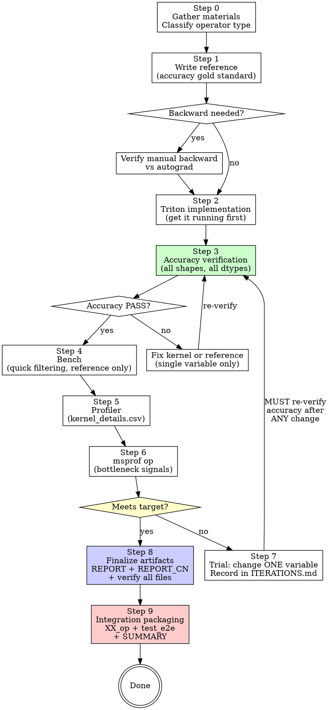

# Triton-Ascend NPU Operator Development

## Overview

End-to-end workflow for developing and optimizing triton-ascend operators on Ascend NPU.

**Core principle:** Correctness before performance. Always. No exceptions.

**Violating the letter of this process is violating the spirit of NPU operator development.**

## The Iron Laws

```
1. NO PERFORMANCE TUNING WITHOUT ACCURACY PASS FIRST
2. NO MULTI-VARIABLE CHANGES IN A SINGLE ITERATION
3. NO ITERATION WITHOUT A WRITTEN RECORD
```

Broke accuracy to chase performance? Rollback. Start over.
Changed two things at once? Can't isolate what worked. Rollback.
Didn't record an iteration? It didn't happen. You'll repeat the same dead end.

**No exceptions:**
- Not for "just a quick BLOCK size change"
- Not for "I'm pretty sure this won't affect accuracy"
- Not for "I'll record it later"

## When to Use

**Use for:**
- Writing new triton-ascend operators (forward and/or backward)
- Optimizing existing kernel performance (profiler/msprof-guided tuning)
- Debugging accuracy mismatches between reference and kernel
- Benchmarking Triton kernels vs Torch baselines
- Generating formal performance comparison reports

**Do NOT use for:**
- Pure Python wrapper optimization (no kernel changes) → standard debugging
- Exploring whether an operator is feasible → brainstorming first
- torch.compile / graph-level optimization → different workflow
- Reading/understanding existing Triton code → repo-explorer

## The Workflow



**Key rules:**
- After ANY change (Step 7), you go back to accuracy verification (Step 3). Not bench. Not profiler. **Accuracy first.**
- **msprof is MANDATORY every iteration**, not optional. Profiler tells you WHAT is slow; msprof tells you WHY. Without WHY, tuning is guessing.

### "Meets Target?" Criteria

All three must be satisfied to declare done:

1. **Kernel performance**: Your kernel's profiler duration must be faster than the baseline's corresponding computation (compare kernel-to-kernel, NOT end-to-end with wrapper ops).
2. **No unaddressed bottleneck signals**: msprof has been analyzed. Either bottlenecks have been optimized, or each remaining signal has a documented conclusion ("analyzed, not actionable because X" is acceptable; silently ignoring signals is not).
3. **Wrapper ops classified**: Every wrapper-generated NPU kernel (Transpose, TensorMove, Copy) in the profiler output must be classified as:
   - **Production-eliminable**: e.g. weight transpose (one-time at model load), input `.contiguous()` (upstream already contiguous)
   - **Inherent overhead**: e.g. layout mismatch with upstream that cannot be negotiated away

Wrapper ops are NOT counted against the performance target, but must be explicitly documented so the integration team knows the true deployment cost.

## Prerequisites

- **Environment self-check (run before starting, all must pass):**
  1. `python3 -c "import triton; print(triton.__version__)"` → triton-ascend installed
  2. `python3 -c "import torch_npu; print(torch.npu.is_available())"` → NPU reachable
  3. `echo $ASCEND_HOME_PATH` → non-empty (CANN env sourced)
  4. `which bishengir-compile` → found (compiler in PATH)
  5. `npu-smi info` → device visible

  If any check fails, source the CANN env script first:
  ```bash
  # Typical locations (pick the one that exists on your machine):
  source $HOME/Ascend/ascend-toolkit/set_env.sh                    # non-root default
  source /usr/local/Ascend/ascend-toolkit/latest/bin/setenv.bash   # root default
  # Or for a specific CANN version directory:
  source $HOME/Ascend/cann-<version>/set_env.sh
  ```
  After sourcing, re-run the checks. If `which bishengir-compile` still fails, locate it manually and add to PATH:
  ```bash
  find $ASCEND_HOME_PATH -name "bishengir-compile" -type f 2>/dev/null
  export PATH=<found_dir>:$PATH
  ```

- Fixed shape set across iterations for valid comparison.
- Fixed seed for reproducibility.

**Environment template:**
```bash
# Ensure CANN env is sourced, then run directly:
python3 <YOUR_ENTRY>.py --B 1 --S 2048 --N 4 --D 2560
```

## Step Details

### Step 0: Input Materials and Operator Classification

- Gather: operator description, pseudocode, reference implementation, or existing source code.
- Classify operator type → choose pattern:

| Operator Type | Key Operations | Pattern | Guide |
|---------------|---------------|---------|-------|
| Pure Vector | Element-wise, small reductions | Standard kernel | [01-vector-add](./demo/official_tutorials/01-vector-add.py) |
| Pure Cube | Matrix multiply only | tl.dot kernel | [05-matmul](./demo/official_tutorials/05-matrix-multiplication.py) |
| CV Mixed | MatMul + activation/norm | CV fusion with `tl.parallel` | [cv-fusion-pattern.md](./guides/cv-fusion-pattern.md) |
| Memory-bound | Gather/scatter/embedding | Custom memory ops | [ascend-api-reference.md](./guides/ascend-api-reference.md) |
| Reduction-heavy | Softmax, LayerNorm | Persistent kernel | [02-softmax](./demo/official_tutorials/02-fused-softmax.py) |

### Step 1: Reference (Accuracy Gold Standard)

Write PyTorch reference with line-by-line correspondence to documentation.

Cross-check:
- Input/output tensor shape, dtype, layout match documentation
- Computation flow matches: reshape, broadcast, mask, reduce, normalize, boundary handling
- Numerical strategy matches: FP32 cast points, eps placement, clamp necessity

**Backward (if needed) — autograd is the first line of defense:**
1. Forward reference + `requires_grad=True` + autograd → gradient baseline
2. Write manual backward reference
3. Verify manual backward vs autograd (**must pass before writing triton kernel**)

```python
# Verify manual backward against autograd
x = torch.randn(..., requires_grad=True)
y = forward_reference(x, ...)
y.backward(grad_output)
x_grad_autograd = x.grad.clone()
x_grad_manual, ... = backward_reference(grad_output, ...)
torch.testing.assert_close(x_grad_autograd, x_grad_manual, rtol=1e-5, atol=1e-5)
```

### Step 2: Triton Implementation

Get a runnable kernel first. If compilation fails, prioritize "minimal runnable version" then incrementally add optimizations.

File conventions, artifact inventory, and git discipline: see [file-conventions.md](./file-conventions.md)

**Required artifacts per operator:** core scripts (triton/ref/test/utils) + README.md + REPORT.md + REPORT_CN.md + ITERATIONS.md + profiler/ + msprof/ directories. Missing any = NOT done.

### Step 3: Accuracy Verification (Required Each Iteration)

**Every iteration. No exceptions. Even "just a BLOCK size change."**

Coverage requirements:
- **Shapes**: small (intermediate alignment) + target benchmark + tail/unaligned (triggering mask/remainder)
- **Dtypes**: per operator convention (commonly BF16 input, FP32 accumulation, BF16/FP32 output)
- **Assertions**: `torch.testing.assert_close` (dtype-appropriate tolerances), `isfinite` (NaN/Inf check)
- **Backward**: forward output aligned first, then gradients: `assert_close` + cosine similarity
- **Stability**: fixed seed, fixed inputs, fixed warmup/iters, no "intermittent pass/fail"

### Step 4: Bench (Quick Filtering)

Measure average duration as filtering entry point.

**⚠️ Bench time is REFERENCE ONLY.** It includes Python overhead (~200-300μs: tensor allocation, view/contiguous, cache lookup, kernel launch). **True kernel time comes from Step 5 profiler.**

### Step 5: Profiler (Identify Biggest Contributor)

Collect `kernel_details.csv`, examine average duration per kernel. This tells you WHAT is slow.

**⚠️ Profiler Data Reliability Rules:**

1. **Run profiler at least twice.** CANN built-in ops (TransposeAiCore, TensorMoveAiCore, CastAiCore) have independent JIT compilation caches NOT covered by Triton warmup. The first profiler run may include cold-start overhead inflating built-in op durations by 5-10x. Always take the second (stable) run.

2. **Bandwidth sanity check for wrapper ops.** After collecting profiler data, compute effective bandwidth for each wrapper op:
   ```
   effective_bw = data_size_MB / duration_us × 1e6  (GB/s)
   ```
   Reference (910B single core): contiguous transpose/copy should achieve 20-40 GB/s. If < 5 GB/s → data is suspect, re-run profiler. If < 1 GB/s → almost certainly cold-start artifact.

3. **Never base architectural decisions on un-validated measurements.** If a profiler number leads to a conclusion like "approach X is not viable", that number MUST be confirmed by a second run before writing it into REPORT or ITERATIONS. Single-measurement architectural conclusions are a process violation.

**CRITICAL: Only count rows with `Step Id`** (skip warmup rows):
```python
for row in reader:
    step_id = (row.get("Step Id") or "").strip()
    if not step_id:
        continue  # Skip warmup rows
    name = row.get("Name", "").strip()
    duration = float(row.get("Duration(us)", 0))
    durations_us[name] += duration
    kernel_counts[name] += 1
avg_duration = durations_us[name] / kernel_counts[name]
```

**CRITICAL: End-to-end ≠ sum of unique kernel averages.** Wrapper operations (transpose, contiguous, copy) generate NPU kernels (TransposeAiCore, TensorMoveAiCore) that share the same name but appear **multiple times per step**. For example, a wrapper that does `permute().contiguous()` + `weight.t().contiguous()` + kernel + `copy_(permute())` produces 3× TransposeAiCore + 1× TensorMoveAiCore + 1× your kernel = 5 kernels per step.

The correct end-to-end formula is:
```
End-to-End per Step = sum( avg_duration[k] × count_per_step[k] )  for each kernel k
```

`print_profiler_kernel_avg_duration()` in utils.py outputs a **Count/Step** column and **Subtotal/Step** column for this purpose. Always check Count/Step > 1 kernels — they are the most common source of underestimated end-to-end time.

### Step 6: msprof op (Bottleneck Signals → Actions)

**MANDATORY every iteration.** Do NOT skip this step. Profiler (Step 5) tells you WHAT is slow; msprof tells you WHY. Without WHY, tuning is guessing — you end up adjusting BLOCK sizes when the real bottleneck is stride-N gather or layout mismatch.

Translate "slow" into actionable items using msprof CSV metrics.

Quick reference: [op-optimizer.md](./references/op-optimizer.md)
Full guide: [msprof-op.md](./guides/msprof-op.md)
CSV interpretation: [csv-interpretation.md](./guides/csv-interpretation.md)

**Key signals to check:**
- `aiv_mte2_ratio > 50%` + `aiv_vec_ratio < 30%` → memory-bandwidth bottleneck (stride gather, non-contiguous access). Consider layout transformation (wrapper pre-transpose or upstream layout negotiation).
- High `wait_ratio` → pipeline stalls, excessive synchronization
- High `scalar_ratio` → too many grid blocks or compile-time-resolvable branches

**Command template:**
```bash
# ASCEND_HOME_PATH should already be set after sourcing set_env.sh.
# If msprof reports "Can't find libdcmi.so", ensure driver lib is in LD_LIBRARY_PATH:
#   export LD_LIBRARY_PATH=/usr/local/Ascend/driver/lib64:$LD_LIBRARY_PATH
msprof op \
  --kernel-name=<KERNEL_NAME_SUBSTR> \
  --output=<MSPROF_OUTPUT_ROOT>/<TAG> \
  --warm-up=5 --launch-count=1 --kill=on \
  --application="python3 <YOUR_ENTRY>.py --mode run <OTHER_ARGS>"
```

### Step 7: Trial-and-Error with Single-Variable Discipline

Change ONE variable. Record in `ITERATIONS.md` **before starting the next iteration**.

**Two-level recording** to avoid excessive overhead:

**Brief record (one row)** — for quick failures (UB overflow, compile error, minor BLOCK size changes):
```markdown
| # | Change | Result | Note |
|---|--------|--------|------|
| 01 | BLOCK_M=16, BLOCK_D=128 | UB overflow (464KB) | — |
| 02 | BLOCK_M=16, BLOCK_D=64 | UB overflow (232KB) | — |
| 03 | BLOCK_M=16, BLOCK_D=48 | 853µs kernel | baseline, proceed to msprof |
```

**Full record** — required for these two cases only:
1. **Baseline** (first runnable version)
2. **Substantive optimization** (layout change, new strategy driven by msprof signals)

Use the full template from [record-template.md](./record-template.md) for these.

**STOP gate: Write the record BEFORE starting the next iteration.** Do not proceed to the next trial without recording the current one. This is non-negotiable — unrecorded iterations are lost iterations.

Save profiler/msprof outputs to `profiler/iter_NN_<tag>/` and `msprof/iter_NN_<tag>/`.

Failures are valuable: UB overflow, backend unsupported paths, etc. prune future search space. **Record before rollback.**

### Step 8: Finalize Artifacts

**MANDATORY before declaring done.** This step produces the final deliverables.

Generate all missing artifacts by checking against the artifact inventory in [file-conventions.md](./file-conventions.md):

1. **ITERATIONS.md** — verify all iterations (brief + full) are recorded
2. **REPORT.md** — generate from collected profiler/bench/accuracy data
3. **REPORT_CN.md** — Chinese translation, data must be identical to REPORT.md
4. **README.md** — operator description, I/O spec, formula
5. **utils.py** — copy from `skill/tools/utils.py` (do NOT use `sys.path.insert` — the operator directory must be self-contained)
6. **Wrapper Ops Classification** — in REPORT.md, classify every wrapper NPU kernel as production-eliminable or inherent
7. **fusion_result.json** — write final metrics (kernel duration, E2E, accuracy, msprof summary)

**Verify completeness:**
```bash
# All required files must exist:
ls XX_fwd_triton.py XX_fwd_ref.py XX_fwd_test.py utils.py \
   README.md REPORT.md REPORT_CN.md ITERATIONS.md
ls profiler/ msprof/
```

Run through the Completion Checklist in [record-template.md](./record-template.md). Every box must be checked.

### Step 9: Integration Packaging

**MANDATORY for production-bound operators.** This step produces deliverables that can be directly integrated into the target network (e.g., vLLM-Ascend, training framework).

Choose the appropriate template based on operator type:

#### 9A. Inference Operators (forward only, no backward)

Create `XX_op.py` with:
- **Standard interface**: accepts original tensor layouts, handles transpose internally. Drop-in replacement for existing code path.
- **Optimized interface** (if layout transformation exists): accepts pre-transposed layouts, zero wrapper overhead. For production deployment with upstream layout cooperation.
- **Preparation helpers**: one-time functions for model load (e.g., `prepare_weight()`, `prepare_state()`)

Create `test_XX_op.py`:
- Standard interface output vs reference: must match
- Standard interface output vs optimized interface output: must match
- For stateful operators: multi-step accumulation accuracy (state drift check)

Create `test_e2e.py`:
- Simulate the real call chain (e.g., chunk → gate → fused_op → proj)
- For stateful operators: run N consecutive decode steps, compare state and output vs reference at each step
- Report accumulated drift metrics

#### 9B. Training Operators (forward + backward)

Create `XX_op.py` with:
- `torch.autograd.Function` subclass: `forward()` calls fwd kernel + `save_for_backward`, `backward()` calls bwd kernel
- Functional interface (e.g., `xx_quantize()`) wrapping `Function.apply`

Create `test_XX_op.py`:
- Forward output vs direct kernel call: bitwise match
- Backward gradients vs direct kernel call: bitwise match
- Gradient flow: `.grad` is not None and finite

Create `test_e2e.py`:
- `torch.autograd.gradcheck` (if dtype supports float64; document skip reason if not)
- Mini training loop: loss decreases, gradients flow, weights update
- Gradient consistency: autograd path vs manual backward kernel call

#### Both types: Create `SUMMARY.md`

Integration summary document containing:
- **Interface documentation**: function signatures, input/output specs, usage examples
- **Deployment requirements**: layout changes, weight preprocessing, upstream dependencies
- **Performance comparison**: original vs standard vs optimized (all data must be confirmed by repeated measurement)
- **Verification results**: wrapper tests + E2E test outcomes

### Git Checkpoints

Commit at every milestone. Never commit broken/unverified code. See [file-conventions.md](./file-conventions.md) for full git discipline.

| Event | Commit |
|-------|--------|
| Reference written + verified | `feat(XX): add reference implementation` |
| Kernel runnable | `feat(XX): add triton kernel (initial)` |
| First accuracy PASS | `feat(XX): accuracy pass on all shapes` |
| Baseline profiler collected | `bench(XX): baseline profiler collected` |
| Iteration accuracy PASS | `opt(XX): iter_NN <tag> — <result>` |
| Iteration FAIL (rollback) | `rollback(XX): iter_NN <tag> — <reason>` |
| Final report + artifacts | `docs(XX): add final report and artifacts` |
| Integration packaging done | `integration(XX): add op wrapper, e2e tests, summary` |

## Red Flags — STOP and Follow Process

If you catch yourself thinking:

- "Accuracy is close enough, let's see performance first"
- "I'll change BLOCK_M and BLOCK_N together, they're related"
- "Bench looks good, skip profiler and msprof this time"
- "I'll record this iteration later"
- "This optimization obviously won't affect accuracy"
- "Just one more quick change before re-running accuracy"
- "The tolerance can be looser for this operator"
- "msprof setup is too annoying, profiler is enough"
- "Profiler ran once, the numbers look reasonable, write them into REPORT"

**ALL of these mean: STOP. You're rationalizing. Follow the process.**

## Common Rationalizations

| Excuse | Reality |
|--------|---------|
| "Accuracy is close enough" | "Close enough" compounds. 1% error × 100 layers = garbage. Fix it. |
| "Just tuning BLOCK sizes, won't affect correctness" | BLOCK sizes affect tiling, masking, reduction order. Re-verify. |
| "Changed two things but they're independent" | On NPU, nothing is independent. UB, pipeline, cache all interact. One variable. |
| "Bench time is good enough, skip profiler" | Bench includes ~300μs Python overhead. A 500μs bench might be 200μs kernel. Profiler tells truth. |
| "I'll record later" | You won't. And when you hit the same dead end next week, you'll wish you had. |
| "This is exploration, not real iteration" | Exploration without records is wandering. Every run that touches hardware gets recorded. |
| "Profiler is enough, don't need msprof" | Profiler shows WHAT is slow. msprof shows WHY. Without WHY, you're guessing. |
| "Manual backward matches my math" | Your math might be wrong. Autograd doesn't lie. Verify. |
| "Profiler ran once, wrapper op looks slow, approach is not viable" | CANN built-in ops have cold-start caches separate from Triton. First-run data can be 5-10x inflated. Re-run before concluding. |

## Common Failures (Quick Reference)

| Symptom | Cause | Action |
|---------|-------|--------|
| UB overflow | BLOCK too large | Reduce BLOCK_D/BLOCK_K/BLOCK_M, or split kernel |
| Backend unsupported | Unsupported IR path | Rollback to last compilable config, smaller step search |
| High variance | Non-determinism | Fix seed, increase iters, ensure no concurrent profiling |
| 2D broadcast precision anomaly | `[:, None] * [None, :]` pattern | Use explicit variable expansion. See [pitfalls](./guides/triton-ascend-pitfalls.md) |
| High scalar_ratio + low vec_ratio | Too many grid blocks | Restructure grid or unroll loops. See [op-optimizer](./references/op-optimizer.md) |
| msprof "Can't find libdcmi.so" | Environment not configured | See [troubleshooting.md](./troubleshooting.md) |
| Wrapper op profiler duration 5-10x higher than expected | CANN built-in op cold-start | Re-run profiler; compute bandwidth sanity check |

For detailed troubleshooting: [troubleshooting.md](./troubleshooting.md)

## Reference Documents

| Document | Content |
|----------|---------|
| [file-conventions.md](./file-conventions.md) | Artifact inventory, naming, code templates, git discipline |
| [record-template.md](./record-template.md) | Iteration record template + checklists |
| [troubleshooting.md](./troubleshooting.md) | msprof environment, import, device issues |
| [env-variables.md](./guides/env-variables.md) | 35+ environment variables by dev stage |
| [op-optimizer.md](./references/op-optimizer.md) | msprof signal → action quick reference |
| [tuning-case-study.md](./references/tuning-case-study.md) | Full tuning example with trial records |
| [triton-ascend-pitfalls.md](./guides/triton-ascend-pitfalls.md) | 14 common NPU pitfalls |
| [benchmark-comparison.md](./guides/benchmark-comparison.md) | Triton vs Torch performance comparison |
| [ascend-api-reference.md](./guides/ascend-api-reference.md) | Ascend-specific Triton API reference |
| [npu-options.md](./guides/npu-options.md) | NPUOptions parameters + msprof correlation |
| [cv-fusion-pattern.md](./guides/cv-fusion-pattern.md) | Cube-Vector fusion programming pattern |
| [autotune-guide.md](./guides/autotune-guide.md) | @triton.autotune usage, NPUOptions in Config, @libentry |
| [migration-from-gpu.md](./guides/migration-from-gpu.md) | GPU Triton → Ascend migration guide |
| [compiler-pipeline.md](./guides/compiler-pipeline.md) | TTIR → Linalg → BiSheng compilation flow |
| [tutorials-index.md](./references/tutorials-index.md) | 15 official tutorials with learning path |

## Tools

| Tool | Purpose |
|------|---------|
| `tools/utils.py` | Profiler, benchmark, accuracy assertion utilities |
| `tools/estimate_ub_usage.py` | Estimate UB memory usage before running kernel |
| `tools/analyze_kernel_ir.py` | Analyze intermediate IR for optimization opportunities |
